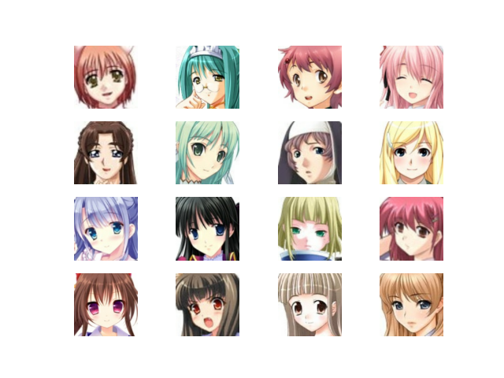

# Generative Anime Face Model
This project focusses on training a generative model, to generate realistic anime faces.

This model is trained on 65k anime face images.



## Model architecture

To view the current architecture of the model, you can just check the
[model summary](media/model_summary.txt).

## Prerequisites

**Make sure to execute the init script, before starting.**

```
./scripts/init.sh

source ~/.alias

conda create -f conda_env.yml [-n custom]

conda activate (gan_anime_faces | custom) 
```

## Run

There are three distinct routines that can be executed, which are specified in the sub-sections below.

To train the model with your custom parameters, just follow the [train](#train) sub-section.

To load the model, including its state, parameters and more just refer to this [sub-section](#load).

If you are just interested in generating images, refer to the [inference](#inference) sub-section.

### Train

If the **train routine** is the desired routine, it is required to specify `--train` when invoking the script.

In this training section we'll just cover the basic parameters that can be used.

```shell
ENTRY --train [--epochs EPOCHS] [--batch-size B_SIZE] [--noise-vector N_VECTOR] [--generate-per-epoch N] [--learning-rate A[, B]] [--no-augment]
```

A different approach is just executing the train script. The easiest way of executing this script, would just be to pass in `S, M or L` with its corresponding level `{1..3}`. This will generate the final command on the fly, abstracting away the inner arguments.

**Note** : S = Small , M = Medium , L = Large is used as acroynm to describe the amount of time for training. I.e S is the routine which takes the least time.

```shell
TRAIN [[S,{1..3} | M,{1..3} | L,{1..3}] | [[[D,{E,C,P},{1..3}] | [LR,{1..3}]], [E,{1..3}], [N,{1..3}], [B,{1..3}]] | [-h]]
```
If you to want to customize your learning rate over epochs, consider using [learning rate schedulers](#using-learning-rate-schedulers).

Gathering more information about the prior script invocation ? No problem just use the `-h` option.

### Load

Specify `--load` to indicate that the **loading routine** is the desired routine.

```shell
ENTRY --load [--epochs N] [--generate-per-epoch K] [--no-augment]
```

If you don't want to write out the options every time, just consider using the load script, which takes in 3 arguments. `$1` = **generated images per epoch**(1-n), `$2` = **epochs**(1-n) and `$3` = **no data augmentation**(0=no, 1=yes).

```shell
LOAD 5 30 1
```

### Inference

Using `--inference` signals the **last** of the three routines.

```shell
ENTRY --inference [--inference-count N]
```

or optionally there is also an inference script, which can be executed by just passing in the amount of images to generate.

```shell
INF 5
```

### Using learning rate schedulers

If you want to customize the learning rate over epochs, consider using the available learning rate schedulers listed below.

**Note** : It is always required to specify either the basic learning rate or the learning rate scheduler. Using both in conjuction will lead to undefined state.

Available learning rate schedulers : 

+ Exponential Decay : 
    + `--exponential-decay`
+ Polynomial Decay :
    + `--polynomial-decay`
+ Constant Decay : 
    + `--constant-decay`
        + `--constant-decay-boundaries`
        + `--constant-decay-values`

To use a common learning rate scheduler for both, i.e generator and discriminator just pass in the required arguments for the specific decay. However if the contrary is the case, and you want to have distinct decays, i.e discriminator and generator should have its own set of parameters you stack them on top of each other, whereas the first set is used for the generator and the latter for the discriminator correspondigly.  

**Exponential Decay**

```shell
--exponential-decay <initial_learning_rate=float> <decay_steps=integer> <base=float> [<opt1> <opt2> <opt3>]
```

---

**Polynomial Decay**

```shell
--polynomial-decay <initial_learning_rate=float> <decay_steps=integer> <end_learning_rate=float> <power=float> [<opt1> <opt2> <opt3> <opt4>]
```

---

**Constant Decay**

The only build, that differs from the others above, is that this stacking is not allowed in here.
In this build it is required to specify in the `--constant-decay` option, if the arguments in `--constant-decay-boundaries` and `--constant-decay-values` are used for both in common or seperately. Also it is required that the **len(list of arguments)**, specified by `--constant-decay-values` is always `N+1`.

```shell
--constant-decay {1..2} --constant-decay-boundaries [1..N] --constant-decay-values [1..N+1]
```

## Showcase